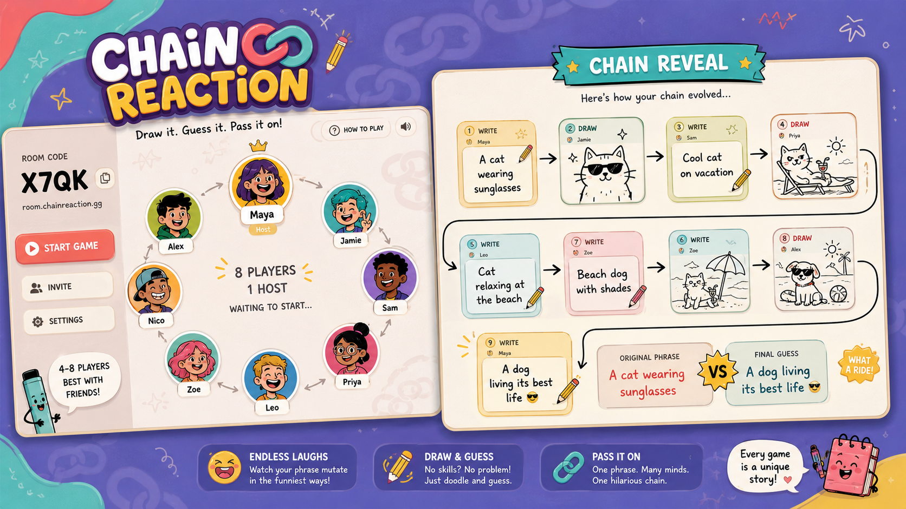
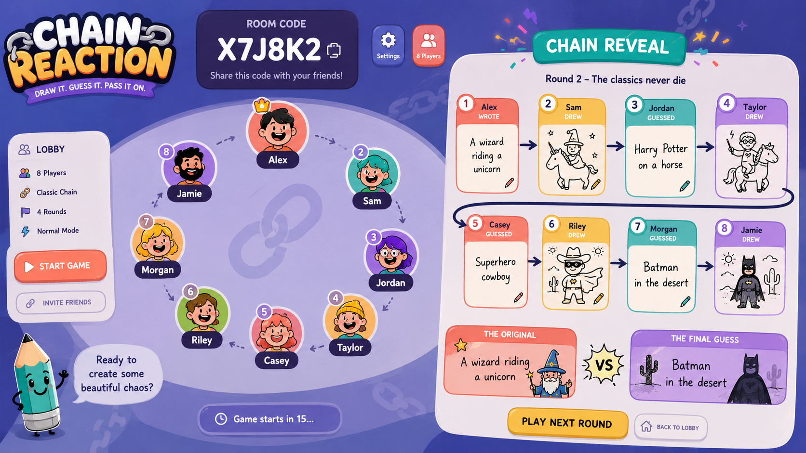

> [!NOTE]
> **[Chain Reaction is live on Vercel!](https://chain-react.vercel.app)** | Explore the **[Interactive Showcase Website](website/index.html)**

<div align="center">

# Chain Reaction 🔗

### Draw it. Guess it. Pass it on.

A telephone-style drawing & guessing party game for 3 to 8 players.  
**Developed by JOJIN JOHN**  
*No accounts • No database • 100% free to host & play*

---

<a href="https://chain-react.vercel.app" target="_blank"></a>
&nbsp;&nbsp;&nbsp;&nbsp;
<a href="website/index.html" target="_blank"></a>
&nbsp;&nbsp;&nbsp;&nbsp;
<a href="https://chain-reaction-game-7ncz.onrender.com/health" target="_blank"></a>

---

</div>

> [!TIP]
> **Play Instantly:** Play right now in your browser at [chain-react.vercel.app](https://chain-react.vercel.app). Open it in 3 or more browser tabs to simulate a multi-player lobby!

---

## Gameplay Preview

<p align="center">
  
  &nbsp;
  
</p>

---

## Table of Contents

- [What is Chain Reaction?](#what-is-chain-reaction)
- [Gameplay Preview](#gameplay-preview)
- [How it Works](#how-it-works)
- [Features](#features)
- [Architecture & Tech Stack](#architecture--tech-stack)
- [Deployment Guide](#deployment-guide)
  - [Frontend (Vercel)](#frontend-vercel)
  - [Backend (Render)](#backend-render)
- [Game Rules Recap](#game-rules-recap)
- [Developer](#developer)
- [License](#license)

---

## What is Chain Reaction?

**Chain Reaction** is an open-source, real-time multiplayer telephone game (inspired by Telestrations and Gartic Phone). 

Players alternate between writing phrases and drawing pictures. At the end of the round, everyone watches the chain unfold from the original prompt to the hilarious final guess!

### Why Play Chain Reaction?

- ⚡ **Instant Rooms**: Create or join rooms with a simple 5-character room code.
- 🔒 **Zero Footprint**: No registration, no login, and no databases — everything runs strictly in-memory.
- 📱 **Mobile & Desktop Friendly**: Draw easily on touchscreens or with a mouse.

---

## How it Works

```text
┌─────────────────┐       ┌─────────────────┐       ┌─────────────────┐       ┌─────────────────┐
│ Player 1 Writes │  ──►  │ Player 2 Draws  │  ──►  │ Player 3 Guesses│  ──►  │  Final Reveal   │
│ "Flying Cat"    │       │ the picture     │       │ "Superhero Cat" │       │ Watch the chain │
└─────────────────┘       └─────────────────┘       └─────────────────┘       └─────────────────┘
```

1. **Step 1 — Write**: Everyone writes a secret prompt.
2. **Step 2 — Draw**: Prompts are shuffled. You draw what the previous player wrote.
3. **Step 3 — Guess**: You guess what the previous player drew.
4. **Loop**: The cycle alternates until every chain makes a full loop around all players.
5. **Reveal**: Watch the hilarious evolution of every chain together!

---

## Features

- **Real-Time Synchronized Lobby**: Powered by Socket.io WebSockets.
- **Interactive Canvas**: HTML5 Canvas with custom color palettes, brush sizes, and clear controls.
- **Dynamic Host Controls**: Host manages game initialization and chain reveal steps.
- **Privacy First**: Game state disappears the moment players leave the room.

---

## Architecture & Tech Stack

| Layer | Technology | Description |
| --- | --- | --- |
| **Frontend** | React 18 + Vite | Fast SPA UI with responsive canvas drawing component |
| **Backend** | Node.js + Express | Lightweight server handling room lifecycle & HTTP endpoints |
| **Sockets** | Socket.io | Bi-directional real-time communication for game steps |
| **Hosting** | Vercel + Render | Decoupled client & server deployment architecture |

---

## Deployment Guide

### Frontend (Vercel)

1. Connect repo `jojin1709/chain-reaction-game` to Vercel.
2. Set Root Directory to `client`.
3. Add Environment Variable:
   - `VITE_SERVER_URL` = `https://chain-reaction-game-7ncz.onrender.com`
4. Deploy to get your live URL (e.g., `https://chain-react.vercel.app`).

### Backend (Render)

1. Create a new **Web Service** on Render connected to `jojin1709/chain-reaction-game`.
2. Root Directory: `server`
3. Build Command: `npm install`
4. Start Command: `npm start`

---

## Game Rules Recap

- **Player Limit**: 3–8 players per room.
- **Host Privileges**: Only the room creator can start the game and advance reveal slides.
- **Anonymity**: Players only see the previous step, keeping the chain secret until the final reveal!

## Community & Policies

- 🔒 **[License](LICENSE)** — Proprietary (All Rights Reserved)
- 🤝 **[Contributing Guidelines](CONTRIBUTING.md)** — Bug reports & contribution rules
- 🕊️ **[Code of Conduct](CODE_OF_CONDUCT.md)** — Contributor Covenant v2.1
- 🛡️ **[Security Policy](SECURITY.md)** — Vulnerability reporting guidelines

---

## Developer

Developed with ❤️ by **[JOJIN JOHN](https://www.linkedin.com/in/jojin-john/)**.

---

## Copyright & License

© 2026 **JOJIN JOHN**. All Rights Reserved.

No part of this codebase or application may be copied, reproduced, modified, or redistributed without explicit written permission from the author.

<p align="center">
  <b>Developed & Created by <a href="https://www.linkedin.com/in/jojin-john/">JOJIN JOHN</a></b>
</p>
